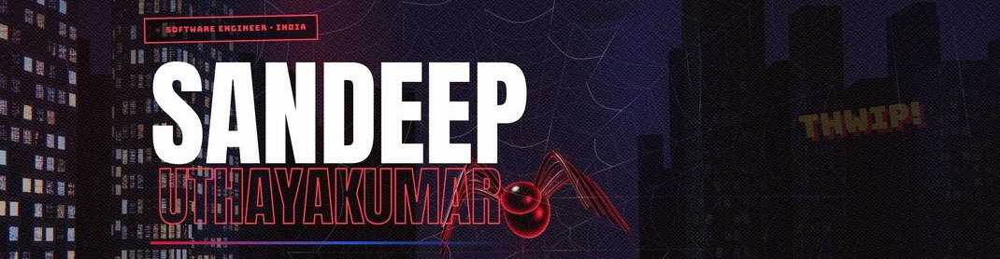
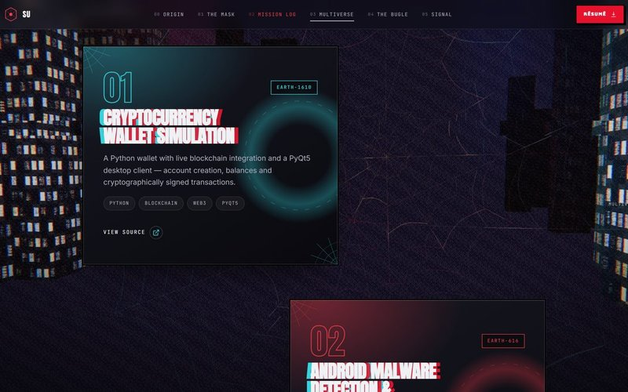
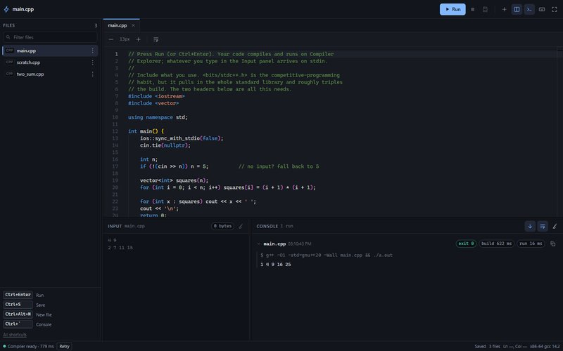

<a href="https://sandeep2k5.is-a.dev/"></a>

I'm a software engineer at **HSBC**, working on trading floor applications for front-office desks and on the Verint compliance platform. Before that I built backend APIs, full-stack web apps, and deep learning models that ended up in two published papers.

I like owning a thing end to end, from the data layer to the interface, and then making it fast.

[Portfolio](https://sandeep2k5.is-a.dev/) &nbsp;·&nbsp; [LinkedIn](https://www.linkedin.com/in/sandeep-uthayakumar-8b7242255/) &nbsp;·&nbsp; [sandeeputhayakumar@gmail.com](mailto:sandeeputhayakumar@gmail.com)

<br />

### Selected work

<table>
  <tr>
    <td width="50%" valign="top">
      <a href="https://sandeep2k5.is-a.dev/"></a>
      <p><a href="https://github.com/Sandeep2k5/Portfolio"><b>Portfolio</b></a><br />
      One three.js scene that you scroll through as a camera flight across a city. Six hand-written GLSL shaders, styled after Spider-Verse.</p>
      <sub><code>React</code> <code>three.js</code> <code>GLSL</code></sub>
    </td>
    <td width="50%" valign="top">
      <a href="https://sandeep2k5.github.io/learning-project/"></a>
      <p><a href="https://github.com/Sandeep2k5/learning-project"><b>DSA Browser IDE</b></a><br />
      Write C++ in the browser, type a test case, press Run. It compiles on Compiler Explorer and answers in about a second.</p>
      <sub><code>React</code> <code>Vite</code> <code>Monaco</code> <code>C++</code></sub>
    </td>
  </tr>
</table>

**[Android Malware Detection](https://github.com/Sandeep2k5/Artificial-Intelligence-Model-for-Android-Malware-Detection)**<br />
A CNN-LSTM and Random Forest pipeline that flags malicious APKs and predicts which malware family they belong to. 99.98% F1-score, published at IEEE ICCCNT 2025.

**[Cryptocurrency Wallet](https://github.com/Sandeep2k5/Cryptocurreny-Wallet)**<br />
A Python wallet with its own ledger, proof-of-work transaction validation and a PyQt5 desktop client. Built during my research internship at NIT Puducherry.

<br />

### Experience

```text
2026 – now    HSBC               Software Engineer     Trading floor systems, Verint compliance platform
2025          VidyaInternaHub    Backend Intern        CRM APIs 70% faster, ~75k requests/hour sustained
2023          NIT Puducherry     Research Intern       Blockchain wallet with a PyQt5 desktop client
```

### Research

- **APK Malware Detection and Family Prediction Using CNN-LSTM and RF Classifiers**<br />
  <sub>IEEE · 16th ICCCNT · 2025</sub>
- **[Multi-Head Attention Transformer for Text-to-Text Translation](https://www.sciencedirect.com/science/article/pii/S1877050925015509)**<br />
  <sub>Procedia Computer Science · ScienceDirect · 2025</sub>

### Tools I reach for


